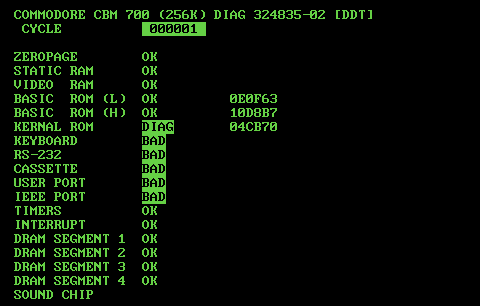

# CBM-II Diagnostics

## Improved [324835](https://github.com/cbm2/diagnostics/324835) for B-Series

An improved B-Series 324835 Diagnostics ROM, available as Cartridge ROM or Kernal ROM replacement.  
Supported machines: B128, B256 (CBM 600 and 700 series).

Enhanced features added:
- Kernal replacement support.
- ROMs id (using 24-bit checksum).
- Improved SID audio test (needs more work).

### Tests perfomed

- **ZEROPAGE**: A functional zero page (static RAM address $00 to $FF) is critical to run all subsequent tests.
- **STATIC RAM**: This tests the 2 KB static RAM in bank 15. This is required to run all subsequent tests.
- **VIDEO RAM**: This tests 2 KB of Video static RAM. This is where the screen chars matrix is stored.
- **BASIC ROM (L)**: Test the low 8 KB of BASIC ROM. Print a 24-bits (6 hex digits) checksum to allow identifying the ROM.
- **BASIC ROM (H)**: Test the high 8 KB of BASIC ROM. Print a 24-bits (6 hex digits) checksum to allow identifying the ROM.
- **KERNAL ROM (H)**: Test the 8 KB of KERNAL ROM. Print a 24-bits (6 hex digits) checksum to allow identifying the ROM. If the Kernal ROM has been replaced by the Kernal version of this Diagnostics, then "DIAG" will be printed and the checksum will allow identifying this Diagnostics release.
- **KEYBOARD**: [Requires harness]. Test the keyboard through the 6525 Tri Port (U84) interface.
- **RS-232**: [Requires harness]. Test the keyboard using the 6551 interface.
- **CASSETTE**: [Requires harness]. Test the cassette interface.
- **USER PORT**: [Requires harness]. Test the user port through the 6526 CIA and 6525 Tri Port (U8) interface.
- **IEEE PORT**: [Requires harness]. Test the IEEE port through the 6526 CIA and 6525 Tri Port (U8) interface.
- **TIMERS**: Test 6526 CIA timers.
- **INTERRUPT**: Test interrupts using the 6526 CIA and 6525 Tri Port (U8) interface.
- **DRAM SEGMENTS**: Test 2 (B128) or 4 (B256) 64 KB segments of DRAM. Reports bit errors and location.
- **SOUND CHIP**: Plays some sounds with the SID 6581, and does a very poor attempt at a filter sweep. This test is very poorly implemented and should be improved.

### Optional Harness

If run without Diagnostics harness (loopback dongles, et cetera), expect the diagnostics to report several errors (e.g. RS-232 test).  
Nevertheless, the main system components can be tested and validated even without harness.  
For more information about the harness, see here:  
https://www.zimmers.net/anonftp/pub/cbm/b/carts/324835-01-diag.zip

# LICENSE

Creative Commons, CC BY

https://creativecommons.org/licenses/by/4.0/deed.en

Please add a link to this github project.
